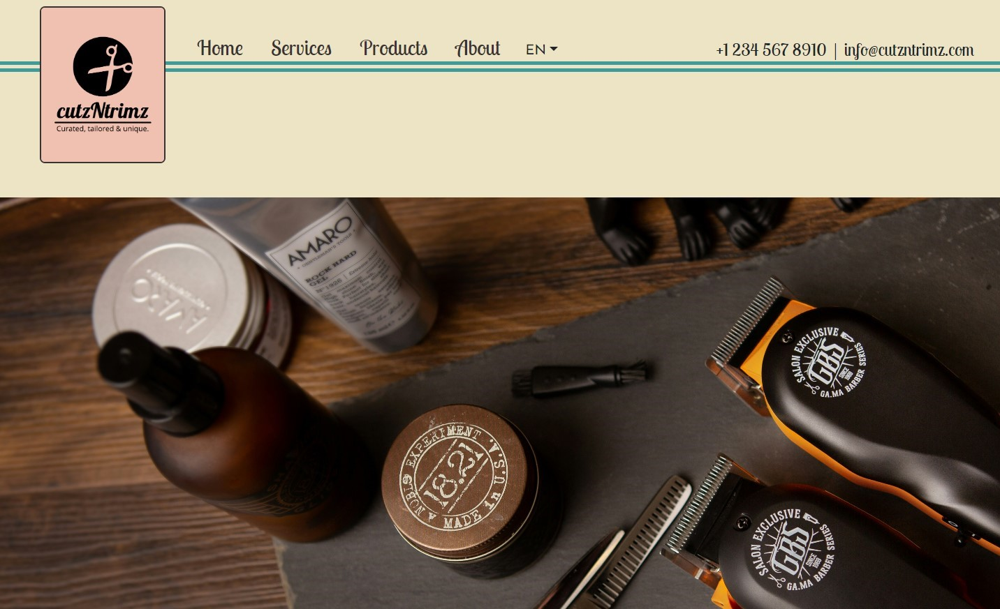

<h1 align="center">cutzNtrimz</h1>

###

This project is a comprehensive website designed for a barber's shop, featuring essential pages such as Home, Services, Products, and About. Additionally, the website incorporates multilingual support, with pages translated into three different languages to cater to a diverse audience.

  

###

<h2 align="left">About the project</h2>

###

Home Page: Introduces the barber's shop with engaging content and visuals, providing visitors with an overview of company.  Services Page: Details the various services provided by the barber's shop, including haircuts, shaves, beard trims, and more, along with pricing information.  Products Page: Showcases the range of products available for purchase, with descriptions and images to entice customers.  About Page: Offers essential information abou the hypothetical copany, lthe fictional team, and references to the icons used for the services page.  Multilingual Support: Ensures inclusivity by providing translations of the website content into three different languages: English, Icelandic and Polish.

###

<h2 align="left">Coded with:</h2>

###

  
  
  
  
  
  
  
  
  
  
  
  
  

###

© 2024 - cutzNtrimz

###
